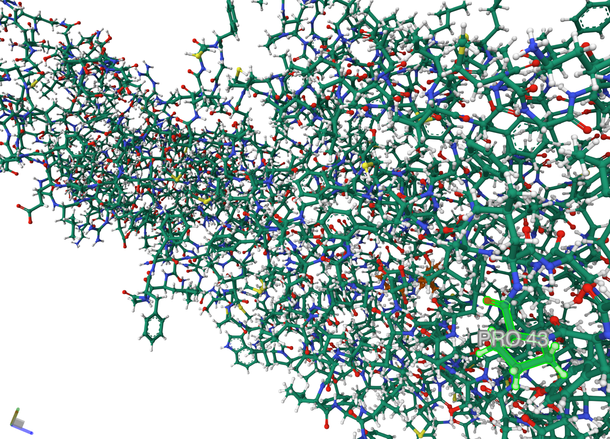

• Use this guide https://mmcif.wwpdb.org/docs/user-guide/guide.html

• Find information about the citation, sequence, composition of macromolecules, mutation if any

The molecule is: **7PMY**

**citation:**\
_citation.title                   
;Structural snapshots of human PepT1 and PepT2 reveal mechanistic insights into substrate and drug transport across epithelial membranes.\
_citation.year                      2021 \
_citation.database_id_CSD           ? \
_citation.pdbx_database_id_DOI      10.1126/sciadv.abk3259 \
_citation.pdbx_database_id_PubMed   34730990 \
_citation.pdbx_database_id_patent   ? \
_citation.unpublished_flag          ? 

loop_\
_citation_author.citation_id \
_citation_author.name \
_citation_author.ordinal \
_citation_author.identifier_ORCID \
primary 'Killer, M.'      1 0000-0003-2647-5138 \
primary 'Wald, J.'        2 0000-0002-1539-6488 \
primary 'Pieprzyk, J.'    3 ?                   \
primary 'Marlovits, T.C.' 4 0000-0001-8106-4038 \
primary 'Low, C.'         5 0000-0003-0764-7483 

**sequence**\
loop_\
_entity_poly.entity_id \
_entity_poly.type \
_entity_poly.nstd_linkage \
_entity_poly.nstd_monomer \
_entity_poly.pdbx_seq_one_letter_code \
_entity_poly.pdbx_seq_one_letter_code_can \
_entity_poly.pdbx_strand_id \
_entity_poly.pdbx_target_identifier 

1 'polypeptide(L)' no no \
;MNPFQKNESKETLFSPVSIEEVPPRPPSPPKKPSPTICGSNYPLSIAFIVVNEFCERFSYYGMKAVLILYFLYFLHWNED\
TSTSIYHAFSSLCYFTPILGAAIADSWLGKFKTIIYLSLVYVLGHVIKSLGALPILGGQVVHTVLSLIGLSLIALGTGGI\
KPCVAAFGGDQFEEKHAEERTRYFSVFYLSINAGSLISTFITPMLRGDVQCFGEDCYALAFGVPGLLMVIALVVFAMGSK\
IYNKPPPEGNIVAQVFKCIWFAISNRFKNRSGDIPKRQHWLDWAAEKYPKQLIMDVKALTRVLFLYIPLPMFWALLDQQG\
SRWTLQAIRMNRNLGFFVLQPDQMQVLNPLLVLIFIPLFDFVIYRLVSKCGINFSSLRKMAVGMILACLAFAVAAAVEIK\
INEMAPAQPGPQEVFLQVLNLADDEVKVTVVGNENNSLLIESIKSFQKTPHYSKLHLKTKSQDFHFHLKYHNLSLYTEHS\
VQEKNWYSLVIREDGNSISSMMVKDTESRTTNGMTTVRFVNTLHKDVNISLSTDTSLNVGEDYGVSAYRTVQRGEYPAVH\
CRTEDKNFSLNLGLLDFGAAYLFVITNNTNQGLQAWKIEDIPANKMSIAWQLPQYALVTAGEVMFSVTGLEFSYSQAPSS\
MKSVLQAAWLLTIAVGNIIVLVVAQFSGLVQWAEFILFSCLLLVICLIFSIMGYYYVPVKTEDMRGPADKHIPHIQGNMI\
KLETKKTKL\
;\
;MNPFQKNESKETLFSPVSIEEVPPRPPSPPKKPSPTICGSNYPLSIAFIVVNEFCERFSYYGMKAVLILYFLYFLHWNED\
TSTSIYHAFSSLCYFTPILGAAIADSWLGKFKTIIYLSLVYVLGHVIKSLGALPILGGQVVHTVLSLIGLSLIALGTGGI\
KPCVAAFGGDQFEEKHAEERTRYFSVFYLSINAGSLISTFITPMLRGDVQCFGEDCYALAFGVPGLLMVIALVVFAMGSK\
IYNKPPPEGNIVAQVFKCIWFAISNRFKNRSGDIPKRQHWLDWAAEKYPKQLIMDVKALTRVLFLYIPLPMFWALLDQQG\
SRWTLQAIRMNRNLGFFVLQPDQMQVLNPLLVLIFIPLFDFVIYRLVSKCGINFSSLRKMAVGMILACLAFAVAAAVEIK\
INEMAPAQPGPQEVFLQVLNLADDEVKVTVVGNENNSLLIESIKSFQKTPHYSKLHLKTKSQDFHFHLKYHNLSLYTEHS\
VQEKNWYSLVIREDGNSISSMMVKDTESRTTNGMTTVRFVNTLHKDVNISLSTDTSLNVGEDYGVSAYRTVQRGEYPAVH\
CRTEDKNFSLNLGLLDFGAAYLFVITNNTNQGLQAWKIEDIPANKMSIAWQLPQYALVTAGEVMFSVTGLEFSYSQAPSS\
MKSVLQAAWLLTIAVGNIIVLVVAQFSGLVQWAEFILFSCLLLVICLIFSIMGYYYVPVKTEDMRGPADKHIPHIQGNMI\
KLETKKTKL\
;\
A ? \
2 'polypeptide(L)' no no AF AF B ? \

**composition of molecules:**

1 polymer man 'Solute carrier family 15 member 2' 81861.125 1 ? ? ? HsPepT2 \
2 polymer syn ALA-PHE                             236.267   1 ? ? ? ?       

;

**mutation** 

There are no mutations as the 3rd last columns for both are empty:

loop_
_entity.id 
_entity.type 
_entity.src_method 
_entity.pdbx_description 
_entity.formula_weight 
_entity.pdbx_number_of_molecules 
_entity.pdbx_ec 
_entity.pdbx_mutation 
_entity.pdbx_fragment 
_entity.details 
1 polymer man 'Solute carrier family 15 member 2' 81861.125 1 ? ? ? HsPepT2 
2 polymer syn ALA-PHE                             236.267   1 ? ? ? ?   

## Open the Structure Tab (3D viewer) Change the view to ball and stick,
## Add annotation of 3rd modeled amino acid residue (Gray is unmodeled)

# Exercise on PDB (2)
• Find the PDB entry of hemoglobin structure that is wild type and mutation
• Load them onto https://www.rcsb.org/3d-view/
• Select by Chain (default: Residue)
• Superimpose the mutated and wild type chain.
• Look at the structural difference

Superimposing the Wildtype 1RVW of the human hemoglobin and the Mutation 2HCO at 

