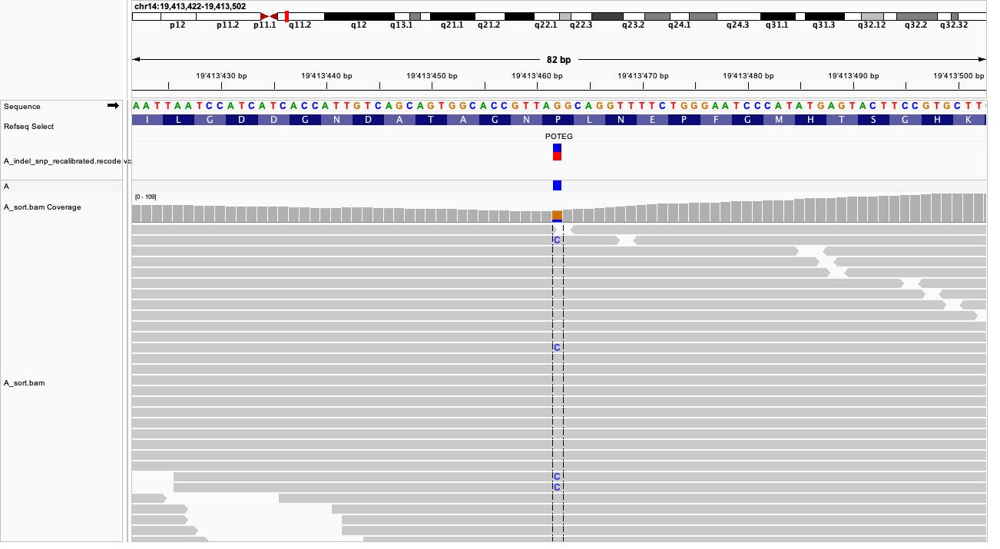
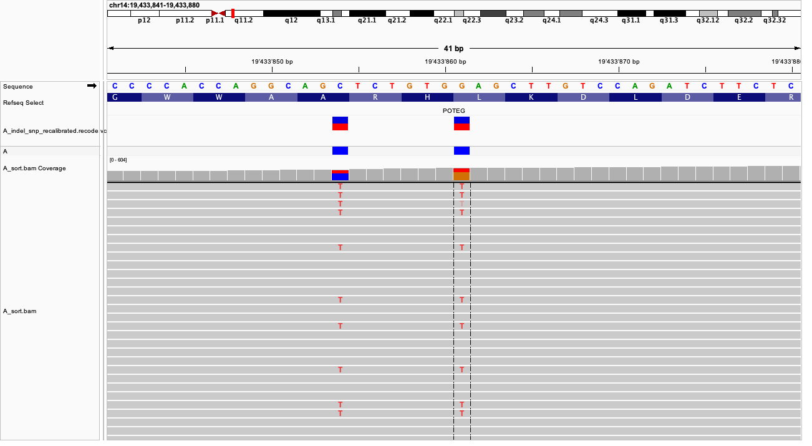
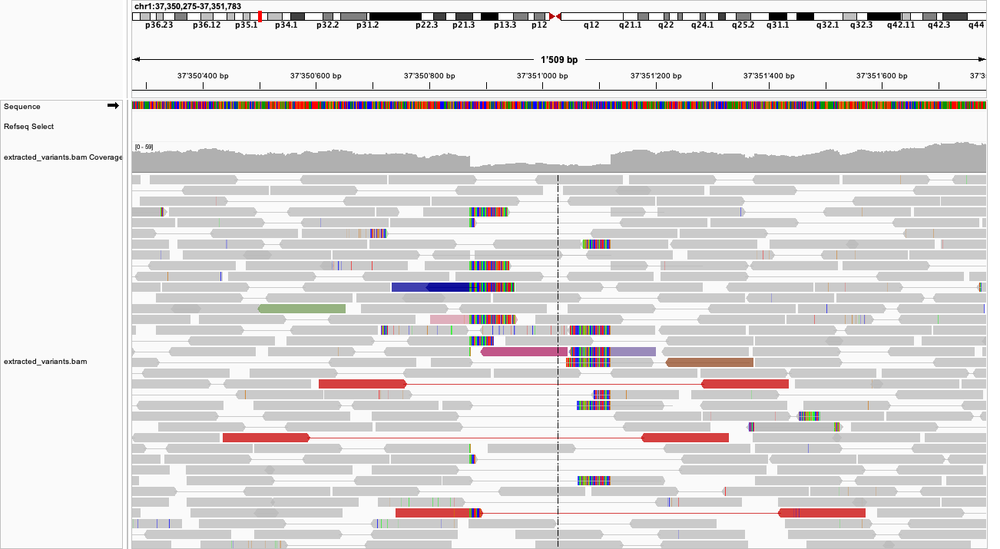
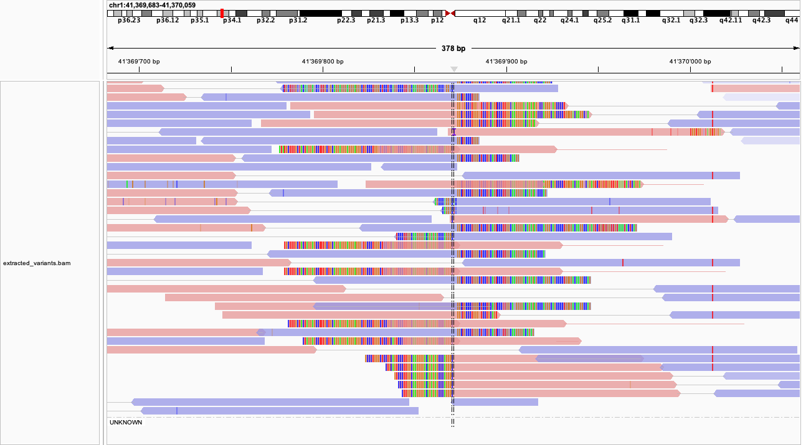
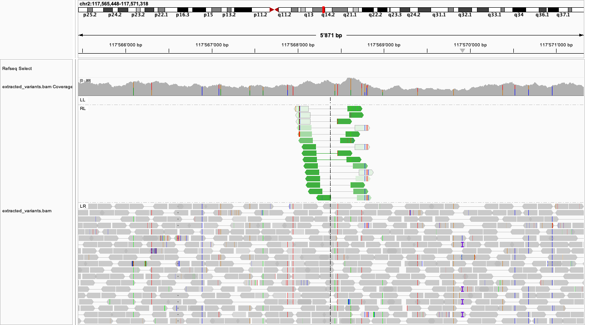

# Exercise 09 - IGV 
Working on sample A Identify two variants: one with a moderate impact and one with a low impact. 
* moderate impact: location 14:19413462-19413462
* low impact: location 14:19433861-19433861

For each variant, answer the following:

The variant type: 
* moderate: missense variant 
* low impact: synonymous variant 

The REF and ALT alleles:
* moderate: REF is G, ALT is C
* low impact: REF is G, ALT is T

The genotype: 
* moderate: G/C
* low impact: G/T

The exact read count supporting the REF and ALT alleles:
* moderate: REF has 34 counts and ALT has 9 counts 
* low impact: REF has 203 counts and ALT has 104 counts 

A screenshot of the variant captured from IGV
* moderate:

* low impact: 

Using IGV, examine the structural variant (SV) in the extract_variants.bam file:
What type of structural variant do you believe this is?
* chr1: 37350877 - 37351115
    - I think this could be a deletion, we see that there is a drop in the coverage, but it is not complete, so it could be heterozygous. But from the soft clipping in the reads around this area one can deduce that they are truncated. 
    By coloring by insert size, we can see that some read pairs are very spread out, indicating that there was a deletion in that region in the sequenced genome. 

* chr1: 41369871 - 41369871
    - From this region one can see a lot of soft-clipping indicating that there is some sort of different sequence. I think this could be an insertion, because the orientation of the reads doesn't change, and there is no change in direction as read and blue reads are all mixed. 

* chr2: 117564013 - 117572037
    - Seeing the green rectangles for the pair orientation we  know that the reference is respected. We also see an increase in the coverage, indicating possibly a duplication of the region. There is also some soft-clipping at the endges of the duplicated regions, showing the break points. 

