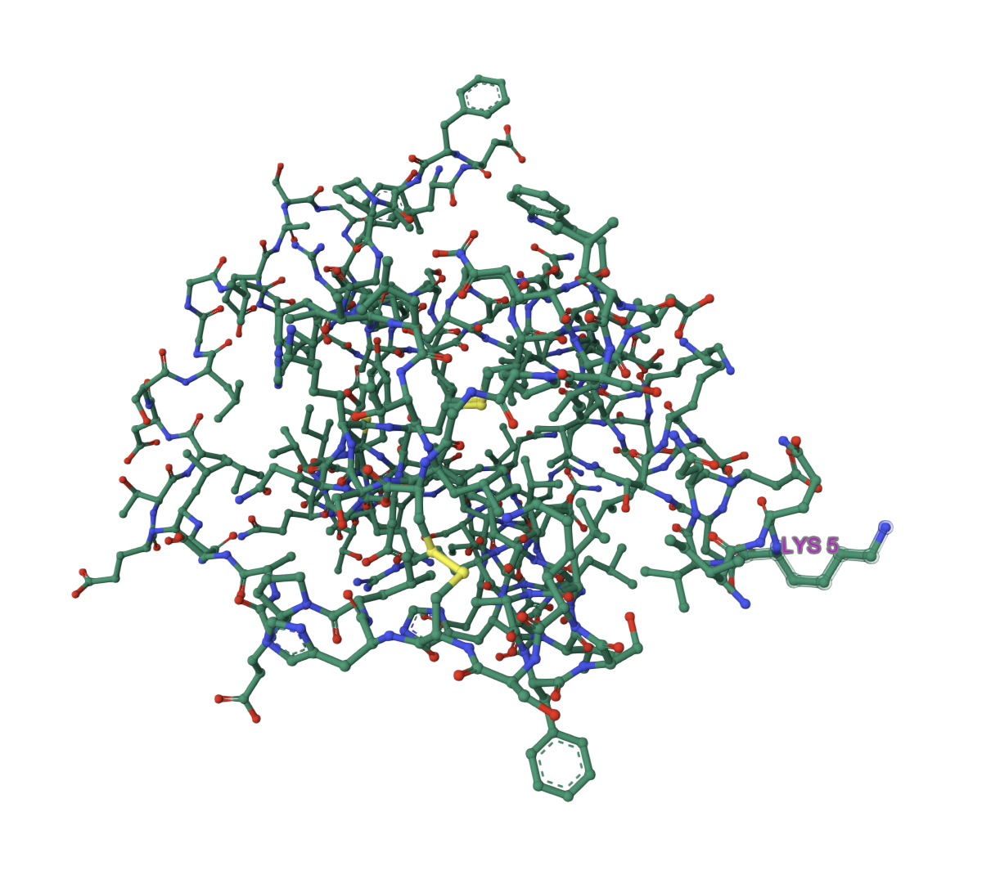
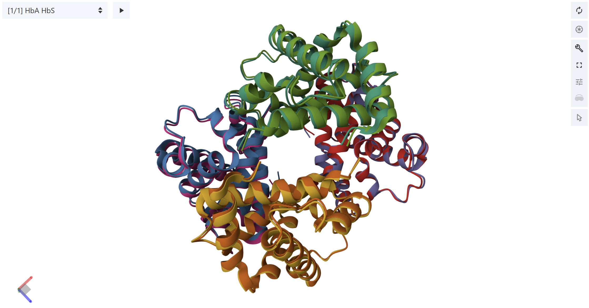

# Exercise on PDB (1)

• Read https://pdb101.rcsb.org/learn/exploring-the-structural-biology-of-health-and-nutrition  

• Use one of them as your protein of interest 

**I chose Leptin**

• Download the PDBx file, from the file 

• Use this guide https://mmcif.wwpdb.org/docs/user-guide/guide.html 

• Find information about the citation, sequence, composition of macromolecules, mutation if any 

    Citation: 'Crystal structure of the obese protein leptin-E100.'                         Nature 387 206 209 1997 NATUAS UK 0028-0836
    Sequence: VPIQKVQDDTKTLIKTIVTRINDISHTQSVSSKQKVTGLDFIPGLHPILTLSKMDQTLAVYQQILTSMPSRNVIQISNDL
    ENLRDLLHVLAFSKSCHLPEASGLETLDSLGGVLEASGYSTEVVALSRLQGSLQDMLWQLDLSPGC
    Composition of Macromolecules: obesity protein , water
    mutation: engineered mutation at pos 100, GLU to TRP, 

• Open the Structure Tab (3D viewer) Change the view to ball and stick,  

• Add annotation of 3rd modeled amino acid residue (Gray is unmodeled)

# Exercise on PDB (2)

• Find the PDB entry of hemoglobin structure that is wild type and mutation 

**I chose the wild type entry 2hhb and the sickle cell mutant 2hbs**

• Load them onto https://www.rcsb.org/3d-view/ 

• Select by Chain (default: Residue) 

• Superimpose the mutated and wild type chain.

**I superimposed them based on the betachain**

• Look at the structural difference

 it seems very small difference, but we know that people with sicklecell anemia have less efficient oxgen transport (and protein hb agregation). But even with so small seeming structural differences, they are still quite big relative to binding molecules (like O2)

