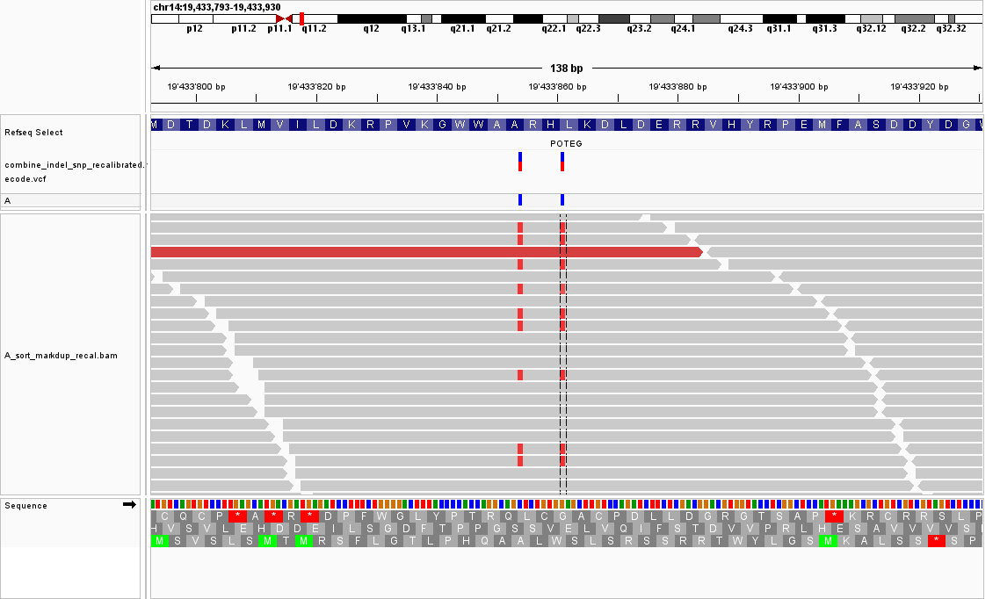
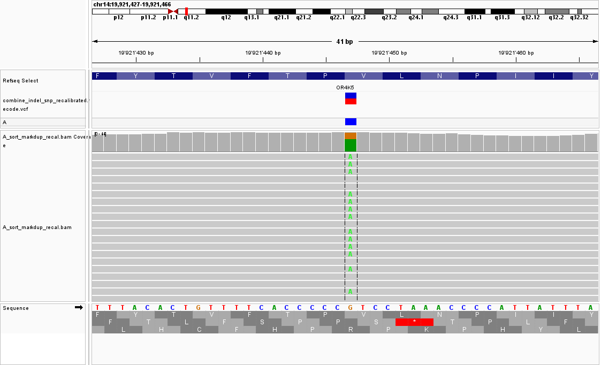
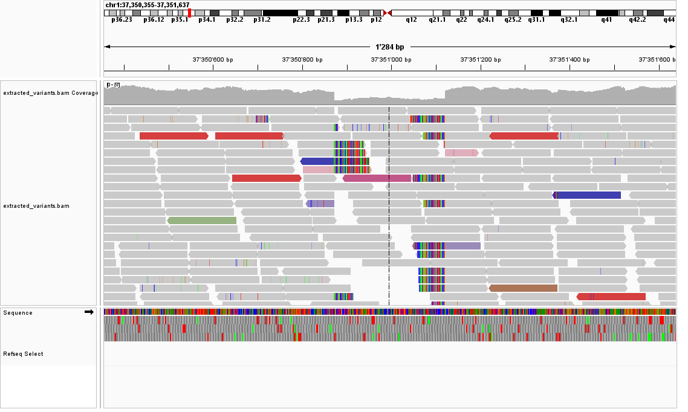
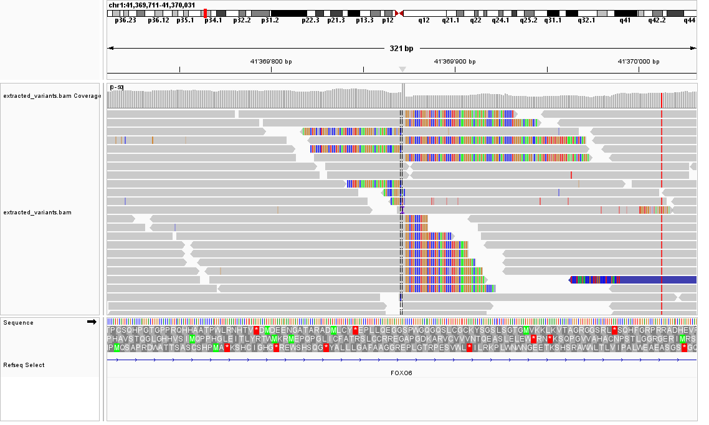
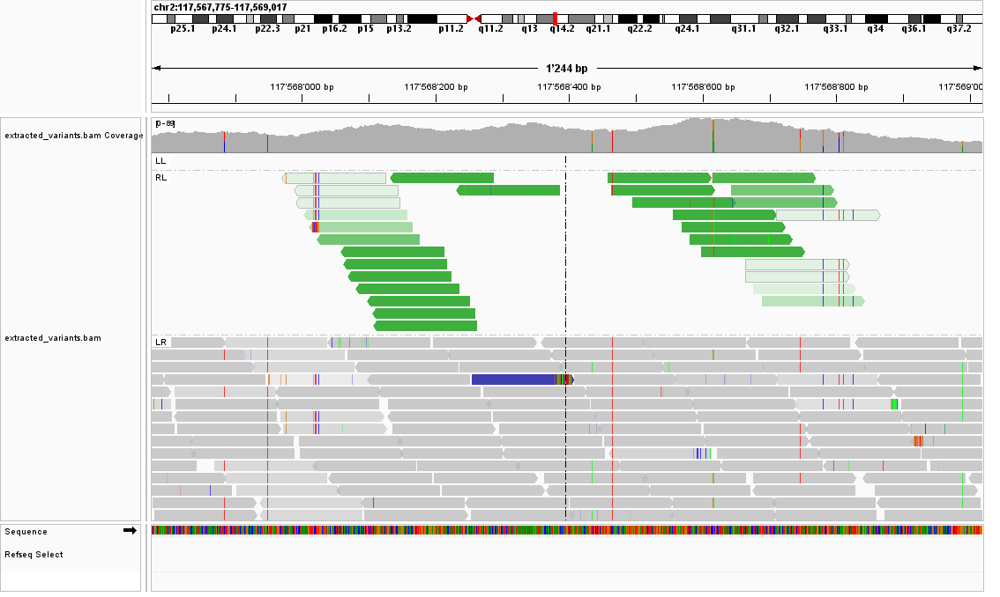

---
## Exercise

Good source for IGV tutorial : https://www.youtube.com/channel/UCb5W5WqauDOwubZHb-IA_rA

---
**Work on sample A**
Identify two variants: one with a moderate impact and one with a low impact. For each variant, answer the following: (I used the vcf file from vqsr)

* The variant type
* The REF and ALT alleles
* The genotype
* The exact read count supporting the REF and ALT alleles
* A screenshot of the variant captured from IGV

### low impact variant: locatiion = 	14:19433861-19433861
variant type = synonymous variant
ref allele: A
ALT allele: T
genotype: heterozygous
read count supporting REF: 203, supporing ALT: 104

### moderate impact variant: location = 	14:19921447-19921447
variant type = missense
ref allele: G
ALT allele: A
genotype: G/A (i.e heterozygous)
read count supporting REF: 26, supporing ALT: 14

---

Using IGV, examine the structural variant (SV) in the `extract_variants.bam` file is this region
* chr1: 37350877 - 37351115
* chr1: 41369871 - 41369871
* chr2: 117564013 - 117572037

and answer the following:
* What type of structural variant do you believe this is?
* Capture an IGV screenshot confirming the event. Make sure the reads are colored appropriately to support your conclusion.
---

### chr1: 37350877 - 37351115

looks like a deletion

### chr1: 41369871 - 41369871
looks like a insertion

### chr2: 117564013 - 117572037
looks like a duplication

